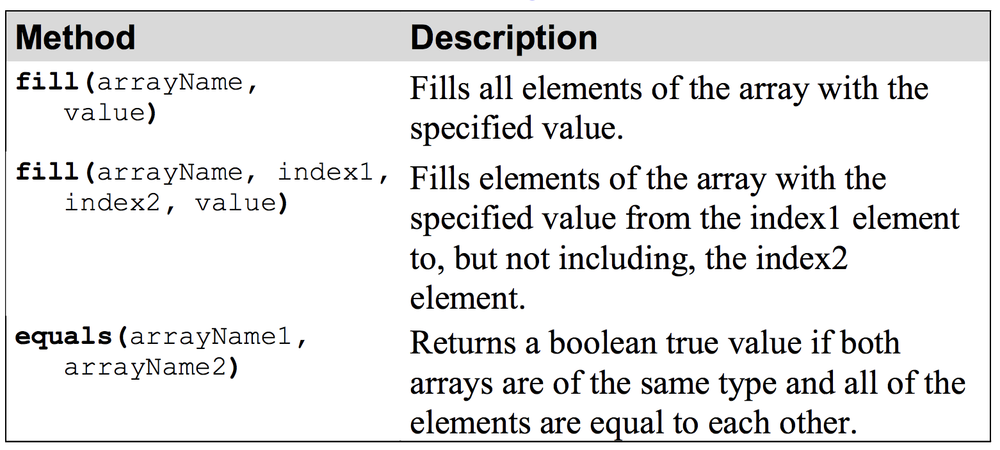
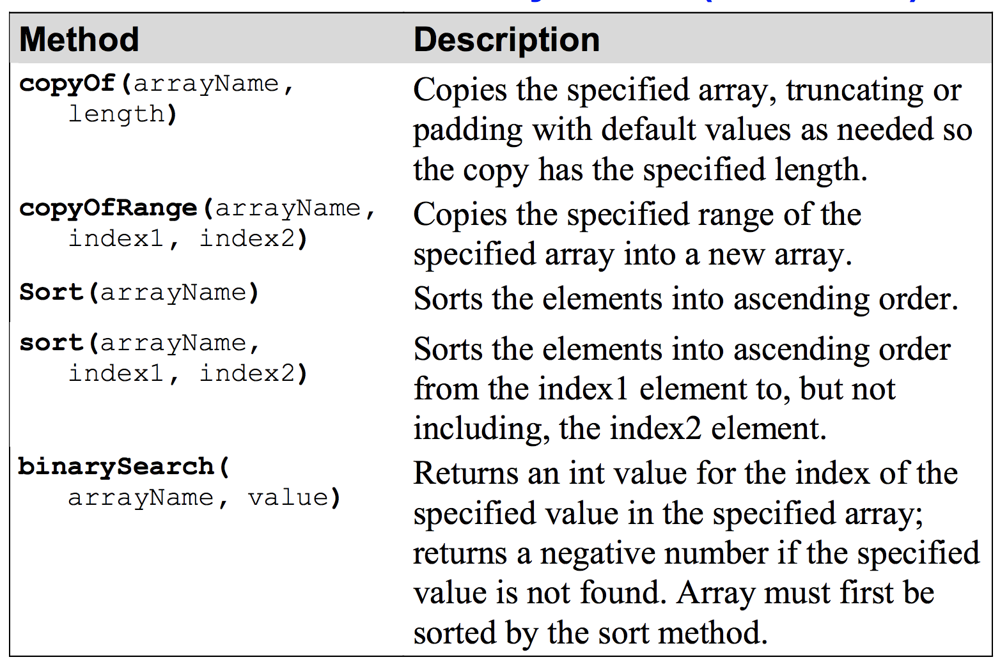

# Arrays and ArrayLists
Array is a data structure that represents a collection of the
same types of data. 

#### How to create an array
- An array can store more than one primitive type or object.
- An element is one of the items in an array.
- To create an array, you must declare a variable of the correct type
and instantiate an array object that the variable refers to.
- To declare an array variable, you code a set of empty brackets after
the type or the variable name.
- To instantiate an array, you use the new keyword and specify the
length, or size, of the array in brackets following the array type.
- You can specify the array length by coding a literal value or by
using a constant or variable of type int.
- When you instantiate an array of primitive types, numeric types are
set to zeros and boolean types to false.
- When you create an array of objects, they are set to nulls.



## ArrayList
#### An introduction to array lists
An array list is a collection that’s similar to an array, but can
change its capacity as elements are added or removed.
- The ArrayList class uses an array to store the elements it contains.
- You can specify the type of elements to be stored in the array list
by naming a type in angle brackets.
- You can specify the size of an array list when you create it, or you
can let the array list default to an initial capacity of 10 elements.
- The capacity of an array list automatically increases whenever
necessary.
```
ArrayList<E>()
Creates an empty array list with an
initial capacity of ten objects of the
specified type.
```
